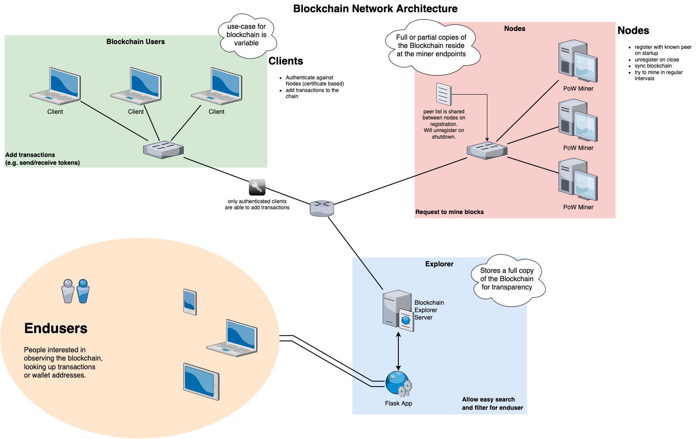

# Python Blockchain Example

> inspired by: https://github.com/satwikkansal/python_blockchain_app/

Implementation of a minimalistic blockchain P2P network and display/search via the provided blockchain explorer

---

## Übersicht
- [Requirements](#requirements)
- [File Structure](#file-structure)
- [How To](#how-to)
- [Why](#why)
- [Work](#work)
- [ToDo](#todo)

## Requirements
```sh
pip install hug Flask requests

  oder

pip install -r requirements.txt
```
- **[hug](https://www.hug.rest)** - microframework for simplified API development
- **[Flask](https://flask.palletsprojects.com/en/2.2.x/)** - web development framework
- **[requests](https://requests.readthedocs.io/en/latest/)** - HTTP library for python

## File Structure
```
Project/
|---Explorer/
|   |---static/img/
|   |   |---dice.svg
|   |---templates/
|   |   |---*.html
|   |---app.py
|---Node/
|   |---src/
|   |   |---blockchain.py
|   |   |---util.py
|   |---node.py
|---architecture.drawio.png
|---readme.md
|---requirements.txt
```

## How To
###### Explorer
Navigate in a terminal to `/Explorer` and type `python app.py` to start the Flask server on `localhost:5000`.
###### Nodes
Navigate to `/Node` and type `python node.py 8000` to start a node on `localhost:8000`. The port number can be changed but the initial Node has to be on <em>8000</em>!

## Why
The nodes represent and endpoint/app for mining and utilising the blockchain.
The explorer is simply there to have a look at what is currently on the blockchain.


